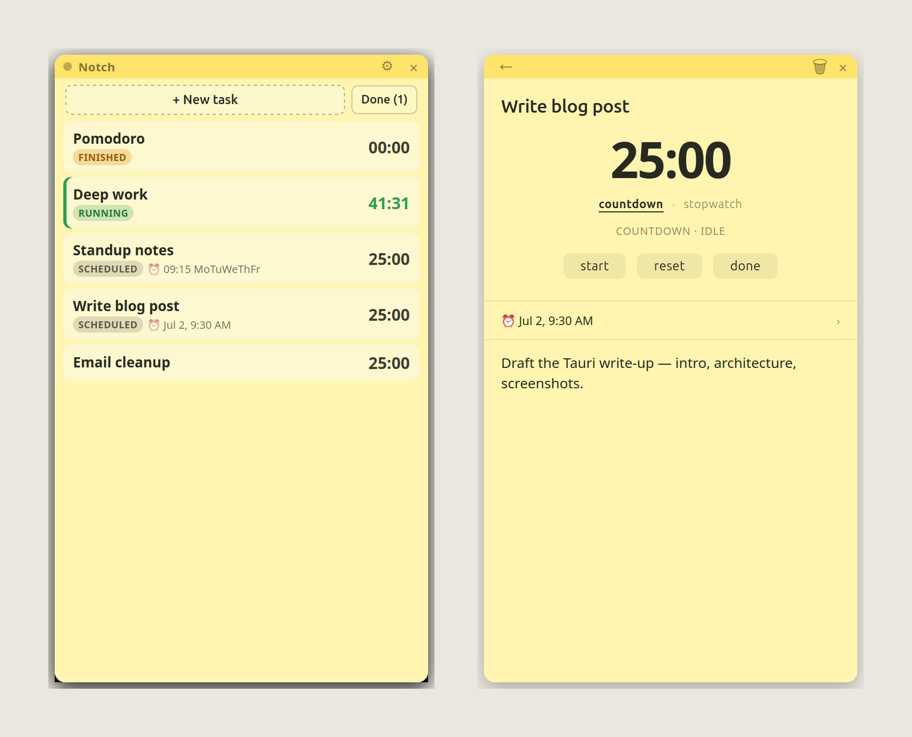

<div align="center">


# Notch

**Sticky notes for your thoughts — each one a task with a timer and a schedule.**

Capture thoughts. Track time. Get things done.

<br />

[](https://github.com/gajjug004/notch/actions/workflows/release.yml)


</div>

<div align="center">



<sub>List view — urgency-sorted, with <code>running</code> / <code>scheduled</code> / <code>finished</code> / <code>done</code> badges — and a task's detail editor with its timer status line.</sub>

</div>

## What it is

Notch is a tiny desktop app: a single frameless, always-on-top sticky-note
window holding a task list. Every task has its own **countdown/stopwatch timer**
and an optional **schedule** that fires a desktop notification and auto-starts
the timer. Click a task to open its full-window detail editor — a hero clock you
can click to edit, start/pause/reset, and a collapsed schedule popover with quick
presets.

Built with **Tauri v2** (Rust backend) + vanilla TypeScript (no framework). The
Rust side owns all state, so timers and schedules keep running accurately even
when the window is closed and never drift.

## Features

- **One window, list + detail** — a sticky note with a row per task, sorted by
  urgency (needs-attention first) with compact `running` / `scheduled` /
  `finished` / `done` badges. Click through to a focused editor.
- **Per-task timers** — countdown or stopwatch, drift-free (driven by a single
  1-second heartbeat in Rust, anchored to a monotonic clock). The detail view
  shows a live status line and explicit `start` / `pause` / `reset` / `done`.
- **Task lifecycle** — mark tasks **done** (hidden by default, revealed with a
  `Done` toggle) and reopen them; inline confirm guards accidental delete.
- **Schedules** — one-shot or recurring (pick weekdays); quick presets
  (15m / 30m / 1h / 3h / tonight / tomorrow) or a custom date + time. On fire:
  notify, raise the window, and optionally auto-start the timer.
- **Alert handling** — when a schedule fires without auto-start, the task offers
  `start` / `snooze 5m` / `snooze 15m` / `dismiss`; a finished countdown offers
  `reset` / `start again` / `done`.
- **Lives in the tray** — closing the window hides it; the app keeps running.
  Tray menu: New task / Show / Settings / Quit. A ⚙ in the title bar opens
  Settings directly.
- **Settings** — default countdown length, schedule presets, sound, autostart,
  and a global pause that freezes every timer (with a persistent banner).
- **Telegram alerts** — optional, event-specific messages for scheduled, due-now,
  and timer-finished events.

## Install

Grab a build from the [Releases](../../releases) page:

| Platform | Artifact |
|----------|----------|
| Debian / Ubuntu | `.deb` |
| Portable Linux | `.AppImage` |
| macOS (Apple Silicon + Intel) | `.dmg` (universal) |

The macOS `.dmg` is **unsigned**. On first launch, right-click the app →
**Open** (or run `xattr -dr com.apple.quarantine /Applications/Notch.app`) to get
past Gatekeeper.

## Build from source

Requires [Node.js](https://nodejs.org), [Rust](https://rustup.rs), and the Tauri
v2 system dependencies for your OS.

```bash
npm install

# Dev (Linux quirks baked in):
WEBKIT_DISABLE_DMABUF_RENDERER=1 npm run tauri dev
#   add GDK_BACKEND=x11 if transparent corners render black

# Package for the current platform:
npm run tauri build
```

Releases are built in CI: pushing a `v*` tag builds the `.deb` + `.AppImage` on
Ubuntu and a universal `.dmg` on macOS, then attaches them to a draft GitHub
Release (see [`.github/workflows/release.yml`](.github/workflows/release.yml)).

## Architecture

**Rust owns all state.** The frontend renders state and sends edits; it never
holds authoritative timer/schedule values.

- State lives in a `Mutex<HashMap<Id, Task>>`, mirrored to
  `tasks.json` under the platform data dir
  (`~/.local/share/com.notch.desktop/` on Linux,
  `~/Library/Application Support/com.notch.desktop/` on macOS).
- A single 1-second tick loop drives **all** timers and schedules.
- One frameless/transparent/always-on-top window swaps between a list view and a
  detail view — no per-task OS windows. Rust emits events globally; the frontend
  routes them by task `id`.

See [`CLAUDE.md`](CLAUDE.md) for the full design and module map, plus `plan.md`,
`progress.md`, and `docs/` for phase specs.

## License

See repository for details.
